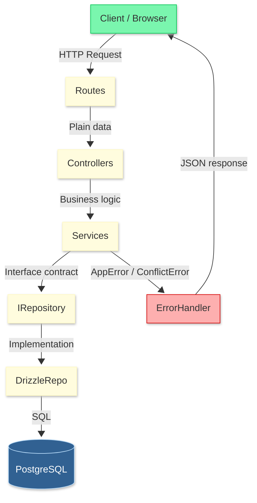

# 🔒 SlotLock — Resource-Aware Scheduling API

> A scheduling API that prevents double booking by validating multiple resources simultaneously using pessimistic locking (`SELECT FOR UPDATE`).

[](https://www.typescriptlang.org/)
[](https://fastify.dev/)
[](https://orm.drizzle.team/)
[](https://nextjs.org/)
[](https://www.postgresql.org/)

---

## 📑 Table of Contents

- [About](#about)
- [Tech Stack](#tech-stack)
- [Architecture](#architecture)
- [Project Structure](#project-structure)
- [Getting Started](#getting-started)
- [Endpoints](#endpoints)
- [Frontend](#frontend)
- [Next Steps](#next-steps)
- [Learn More](#learn-more)

---

## About

SlotLock is a full-stack scheduling system built for service businesses (salons, clinics, studios) where each service requires multiple resources to be available simultaneously — a professional, a room, and equipment.

The name references the core technical mechanism: **pessimistic locking** via `SELECT FOR UPDATE`, which prevents race conditions when multiple clients attempt to book the same resources at the same time.

---


## Tech Stack

### API
| Technology | Description |
|---|---|
| **TypeScript** | Strict mode, path aliases |
| **Fastify** | High-performance HTTP framework |
| **JSON Schema + json-schema-to-ts** | Validation with type inference (no Zod) |
| **Drizzle ORM** | Type-safe SQL with `pg` driver |
| **PostgreSQL 16** | Primary database |
| **Vitest** | Unit testing |
| **Biome** | Linting and formatting |
| **Docker** | Database containerization |

### Frontend
| Technology | Description |
|---|---|
| **Next.js 16** | App Router, TypeScript |
| **TanStack Query** | Server state management and caching |
| **shadcn/ui** | Component library (Nova preset) |
| **Tailwind CSS v4** | Styling |

---

## Architecture

SlotLock follows **Clean Architecture** principles — domain logic has zero framework dependencies.

```
                              ┌─────────────────────────────────────────────────────────┐
                              │                      HTTP Layer                         │
                              │          Routes → Controllers → DTOs                    │
                              ├─────────────────────────────────────────────────────────┤
                              │                     Domain Layer                        │
                              │       Entities → Repository Interfaces → Services       │
                              ├─────────────────────────────────────────────────────────┤
                              │               Infrastructure Layer                      │
                              │          Drizzle Repositories → PostgreSQL              │
                              └─────────────────────────────────────────────────────────┘
```

**Key decisions:**

- **Controllers receive plain data** — not `FastifyRequest`. Routes extract params/body and pass them to controllers. This decouples business logic from the HTTP framework entirely.
- **Domain entities are pure TypeScript** — no Drizzle types leak into the domain. Each repository has a `toDomain()` function that maps raw DB rows to domain entities.
- **Repository interfaces** define contracts — swapping Drizzle for Prisma or MongoDB only requires a new implementation, not changes to business logic.




## Project Structure

```
slotlock/
├── api/                          # Fastify API
│   ├── src/
│   │   ├── @types/
│   │   │   └── fastify.d.ts      # AppInstance with JsonSchemaToTsProvider
│   │   ├── config/
│   │   │   └── env.ts            # Environment validation
│   │   ├── core/
│   │   │   └── errors/           # AppError, ConflictError, NotFoundError
│   │   ├── infra/
│   │   │   ├── database/db.ts    # Drizzle singleton
│   │   │   └── http/
│   │   │       ├── server.ts     # Fastify app factory
│   │   │       ├── error-handler.ts
│   │   │       └── plugins/swagger.ts
│   │   └── modules/
│   │       ├── resources/
│   │       │   ├── domain/
│   │       │   │   ├── entities/Resource.ts
│   │       │   │   └── repositories/IResourceRepository.ts
│   │       │   ├── infra/
│   │       │   │   ├── drizzle/DrizzleResourceRepository.ts
│   │       │   │   └── http/
│   │       │   │       ├── resources.controller.ts
│   │       │   │       └── resources.routes.ts
│   │       │   └── dtos/
│   │       ├── services/         # Same structure as resources
│   │       ├── appointments/
│   │       │   ├── domain/
│   │       │   │   ├── entities/Appointment.ts
│   │       │   │   ├── repositories/IAppointmentRepository.ts
│   │       │   │   └── services/
│   │       │   │       ├── AppointmentService.ts   # Overlap + locking logic
│   │       │   │       └── AvailabilityService.ts  # Hourly slot generation
│   │       │   ├── infra/
│   │       │   │   ├── drizzle/DrizzleAppointmentRepository.ts
│   │       │   │   └── http/
│   │       │   └── dtos/
│   │       └── users/
│   ├── db/
│   │   ├── schema/               # Drizzle table definitions
│   │   ├── migrations/           # Auto-generated by drizzle-kit
│   │   └── seed.ts               # Sample data
│   └── tests/
│       └── appointments/
│           └── overlap.test.ts   # AppointmentService unit tests
│
├── web/                          # Next.js Frontend
│   ├── app/
│   │   ├── page.tsx              # Dashboard
│   │   ├── resources/page.tsx
│   │   ├── services/page.tsx
│   │   ├── appointments/page.tsx
│   │   └── availability/page.tsx
│   ├── components/
│   │   ├── layout/Sidebar.tsx
│   │   └── ui/
│   └── lib/
│       ├── api.ts                # Fetch wrapper
│       ├── types.ts              # Shared TypeScript types
│       └── hooks/                # TanStack Query hooks
│
├── docker-compose.yml            # PostgreSQL container
└── .github/workflows/ci.yml     # Lint + test on push/PR
```

---

## Getting Started

### Prerequisites
- Node.js 20+
- pnpm
- Docker

### 1. Clone the repository

```bash
git clone https://github.com/Tiagossdj/slotlock.git
cd slotlock
```

### 2. Start the database

```bash
docker compose up -d
```

### 3. Set up the API

```bash
cd api

# Install dependencies
pnpm install

# Copy environment variables
cp .env.example .env

# Run migrations
pnpm drizzle-kit migrate

# Seed the database
pnpm seed

# Start the development server
pnpm dev
```

API available at `http://localhost:3000`
Swagger docs at `http://localhost:3000/docs`

### 4. Set up the Frontend

```bash
cd web

# Install dependencies
pnpm install

# Copy environment variables
cp .env.example .env.local

# Start the development server
pnpm dev
```

Frontend available at `http://localhost:3001`


## Endpoints

**Base URL:** `http://localhost:3000/api`

### Resources
| Method | Path | Description |
|--------|------|-------------|
| `GET` | `/resources` | List all resources |
| `GET` | `/resources/:id` | Get resource by ID |
| `POST` | `/resources` | Create a resource |
| `PUT` | `/resources/:id` | Update a resource |
| `DELETE` | `/resources/:id` | Delete a resource (blocked if linked to services) |

### Services
| Method | Path | Description |
|--------|------|-------------|
| `GET` | `/services` | List all services |
| `GET` | `/services/:id` | Get service by ID |
| `POST` | `/services` | Create a service |
| `PUT` | `/services/:id` | Update a service |
| `DELETE` | `/services/:id` | Delete a service |

### Appointments
| Method | Path | Description |
|--------|------|-------------|
| `GET` | `/appointments` | List all appointments |
| `GET` | `/appointments/:id` | Get appointment by ID |
| `POST` | `/appointments` | Create an appointment (validates resources) |
| `PUT` | `/appointments/:id` | Update appointment status |
| `DELETE` | `/appointments/:id` | Delete an appointment |
| `GET` | `/availability` | Get available slots (`?serviceId=&date=`) |

---

## Frontend

The frontend is a management dashboard built with Next.js and TanStack Query, featuring a dark gold theme.

**Screens:**

- **Dashboard** — overview metrics, recent appointments, resource breakdown
- **Resources** — manage professionals, rooms and equipment
- **Services** — manage bookable services and their durations
- **Appointments** — track and update booking status
- **Availability** — check available slots with disabled states for booked/past times

---

## Seed Data

The seed creates a realistic salon scenario:

| Type | Data |
|------|------|
| Resources | Ana Paula (professional), Sala 1 (room), Kit Lash (equipment), Carla (professional), Sala 2 (room), Kit Manicure (equipment) |
| Services | Lash Designer (120 min), Manicure (60 min) |
| Service Resources | Lash Designer → Ana Paula + Sala 1 + Kit Lash, Manicure → Carla + Sala 2 + Kit Manicure |
| Users | client@email.com, admin@slotlock.com |
| Appointments | Sample confirmed appointments on 2026-06-01 |

---

## Next Steps

- [ ] JWT authentication and role-based access (admin vs client)
- [ ] Service-resource management UI (link/unlink resources to services)
- [ ] Pagination on list endpoints
- [ ] Rate limiting

---
## Learn More

Technical decisions, architecture details and known trade-offs are documented in [`docs/`](./docs):

- [`decisions.md`](./docs/decisions.md) — why i chose each technology and approach
- [`architecture.md`](./docs/architecture.md) — system components and layers
- [`ai-context.md`](./docs/ai-context.md) — context for AI coding tools
---


⭐ If this project helped you, leave a star!
